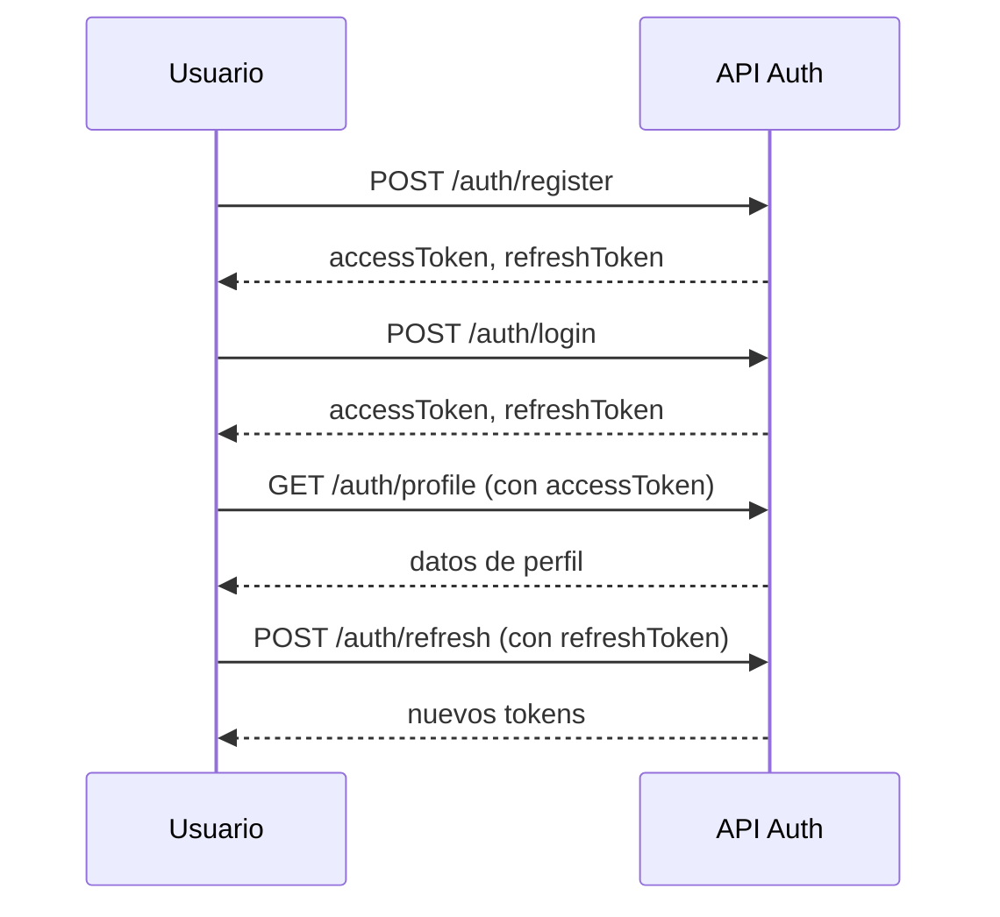

<div align="center">
  
  <h1>🔐 FoodShare Auth Service API</h1>
  <p><b>Microservicio de autenticación y gestión de usuarios para la plataforma FoodShare.</b></p>
  <p>Seguro, escalable y fácil de integrar.</p>
</div>

---

## 🚀 Características

- Registro y login de usuarios con JWT
- Refresh tokens para sesiones seguras
- Actualización y consulta de perfil
- Validación de tokens
- Middleware para roles y protección de rutas
- Validaciones robustas de entrada
- Manejo seguro de errores

## 🛠️ Tecnologías

- Node.js, Express
- Sequelize (PostgreSQL)
- JWT, bcrypt
- express-validator, helmet, cors

---

## 📚 Endpoints principales

### 1. Registro de usuario

`POST /auth/register`

- **Body:**
  ```json
  {
    "email": "usuario@ejemplo.com",
    "password": "TuContraseña123"
  }
  ```
- **Respuestas:**
  - `201 Created`: `{ "accessToken": "...", "refreshToken": "..." }`
  - `400 Bad Request`: Datos inválidos o incompletos
  - `409 Conflict`: El usuario ya existe

### 2. Login

`POST /auth/login`

- **Body:**
  ```json
  {
    "email": "usuario@ejemplo.com",
    "password": "TuContraseña123"
  }
  ```
- **Respuestas:**
  - `200 OK`: `{ "accessToken": "...", "refreshToken": "..." }`
  - `400 Bad Request`: Datos inválidos o incompletos
  - `401 Unauthorized`: Credenciales incorrectas

### 3. Refresh Token

`POST /auth/refresh`

- **Body:**
  ```json
  {
    "refreshToken": "..."
  }
  ```
- **Respuestas:**
  - `200 OK`: `{ "accessToken": "...", "refreshToken": "..." }`
  - `401 Unauthorized`: Token de refresco inválido o expirado

### 4. Perfil de usuario

`GET /auth/profile`

- **Headers:**
  - `Authorization: Bearer <accessToken>`
- **Respuestas:**
  - `200 OK`: `{ "id": 1, "email": "usuario@ejemplo.com", "name": "Nombre" }`
  - `404 Not Found`: Usuario no encontrado

### 5. Actualizar perfil

`PUT /auth/profile`

- **Headers:**
  - `Authorization: Bearer <accessToken>`
- **Body:**
  ```json
  {
    "name": "Nuevo Nombre"
  }
  ```
- **Respuestas:**
  - `200 OK`: `{ "success": true }`
  - `500 Internal Server Error`: Error actualizando perfil

### 6. Validar token

`POST /auth/validate`

- **Body:**
  ```json
  {
    "token": "..."
  }
  ```
- **Respuestas:**
  - `200 OK`: `{ "valid": true, "user": { "id": 1, "email": "usuario@ejemplo.com" } }`
  - `401 Unauthorized`: Token inválido

---

## 🧩 Ejemplo de flujo de autenticación



---

## ⚠️ Errores comunes y soluciones

| Código | Descripción                               | Solución                                |
| ------ | ----------------------------------------- | --------------------------------------- |
| 400    | Datos inválidos o incompletos             | Verifica email y contraseña             |
| 409    | Usuario ya existe                         | Usa otro email o inicia sesión          |
| 401    | Credenciales incorrectas o token inválido | Revisa tus datos o solicita nuevo token |
| 404    | Usuario no encontrado                     | Verifica el accessToken                 |
| 500    | Error interno                             | Contacta al administrador               |

---

## 🔒 Seguridad y buenas prácticas

- Usa HTTPS en producción
- No compartas tus tokens
- Cambia las claves secretas en producción
- Limita los orígenes permitidos con CORS
- Mantén tus dependencias actualizadas
- No expongas información sensible en los errores

---

## 📝 Pruebas rápidas con Postman

1. **Registro:**
   - POST a `/auth/register` con email y password
2. **Login:**
   - POST a `/auth/login` con email y password
3. **Perfil:**
   - GET a `/auth/profile` con el accessToken en el header
4. **Refresh:**
   - POST a `/auth/refresh` con el refreshToken

---

## 📦 Instalación y despliegue

```bash
# Instala dependencias
npm install

# Configura variables de entorno en .env
DB_NAME=foodshare_auth
DB_USER=postgres
DB_PASS=tu_password
DB_HOST=localhost
JWT_SECRET=tu_jwt_secret
JWT_REFRESH_SECRET=tu_refresh_secret

# Ejecuta el servicio
npm run dev
```

---

## 👨‍💻 Contribuciones

¿Tienes ideas o mejoras? ¡Haz un fork y envía tu PR!

---

<div align="center">
  <b>FoodShare Auth Service &copy; 2025</b><br>
  
</div>
